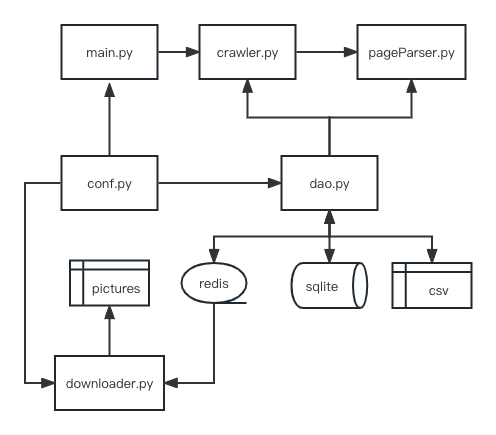

# Pixiv_Top data_scraper
## Soup
### Description
The part of soup contains the full structure of this program. 
The codes are in the file of soup.
The whole process is below:
1. run main.py to start the program.
2. conf.py is to the set the parameters for controlling the whole program.
3. crawler.py is to crawl page links.
4. pageParser.py is to parse single page.
5. dao.py is data persistence layer to operate sqlite, redis and csv.
6. downloader.py will get data from redis pipeline to download covers asynchronously.

### Flowchart

## Scrapy 
The codes are in the file of scrapy/users/users/spiders. 
Using command line to run the script.
1. Type command line: 'scrapy crawl main -O links.csv' to get the links
2. Type command line: 'scrapy crawl pageParser -O links.csv' to get the data 

## Selenium
The codes are in the file of selenium. And run the script of ai_top.py
